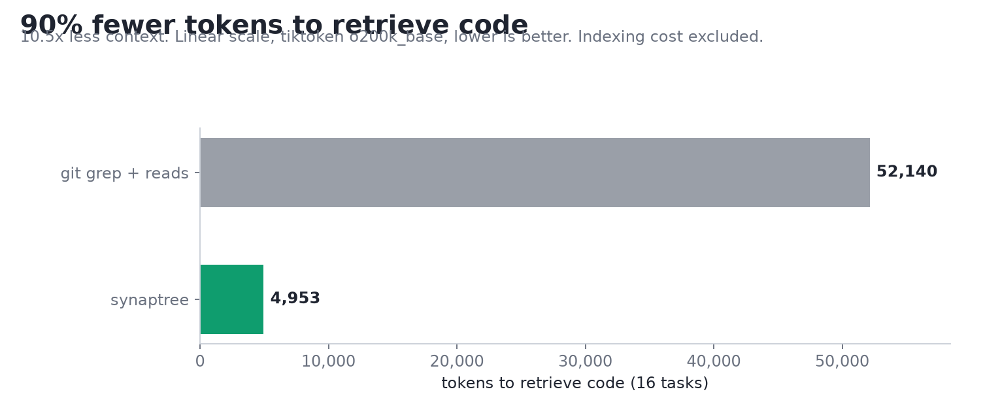
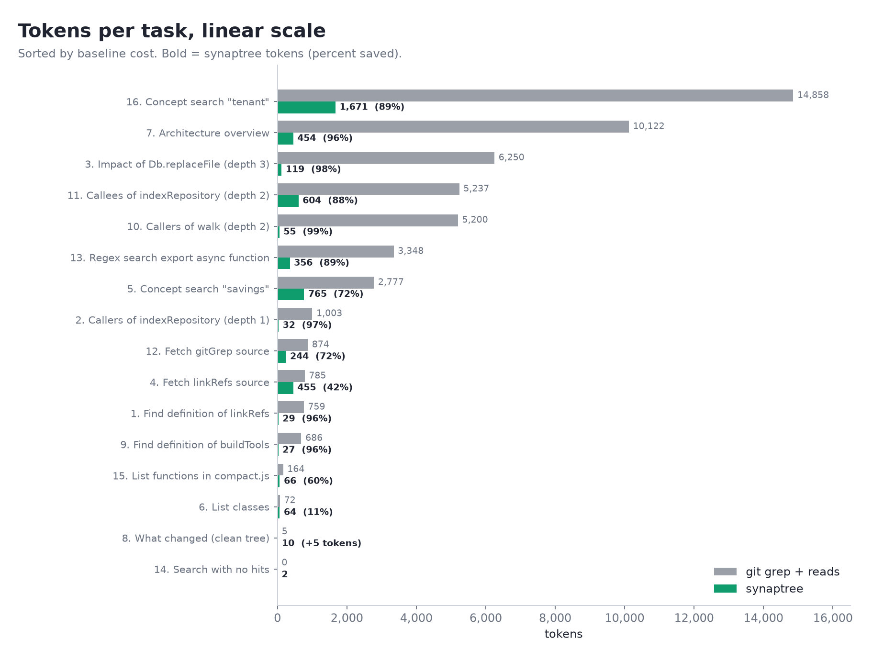
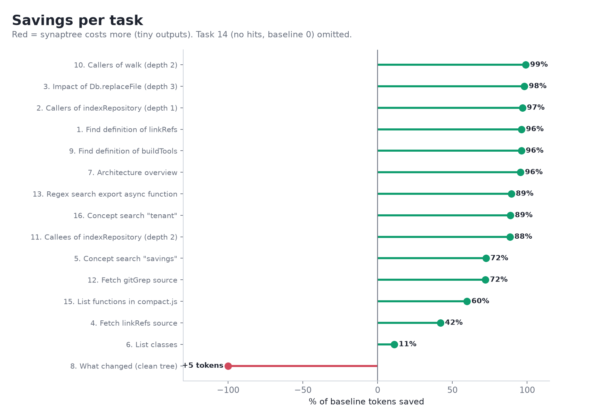
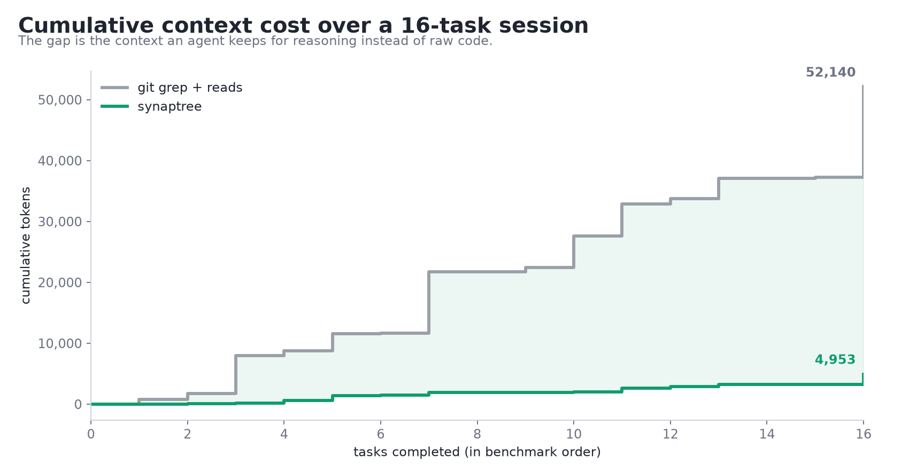
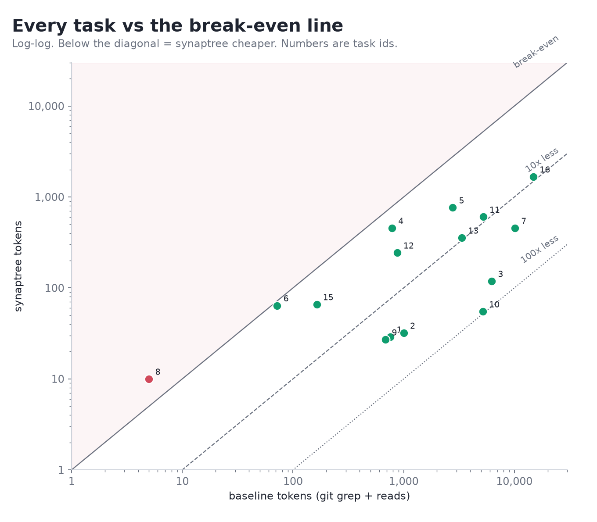

# Benchmark

Token cost of *retrieving code* (search, callers, snippets, overview, changes) with synaptree versus flat `git grep` + line-window reads. Indexing cost is out of scope.

```bash
python -m venv Benchmark/.venv && Benchmark/.venv/Scripts/pip install -r Benchmark/requirements.txt
node Benchmark/capture_graph.mjs http://127.0.0.1:8787 <project>   # saves raw tool responses to results/graph/
Benchmark/.venv/Scripts/python.exe Benchmark/measure.py            # writes results/REPORT.md
Benchmark/.venv/Scripts/python.exe -m unittest discover -s Benchmark -p "test_*.py"
```

- `tasks.json`: 16 tasks, each with a graph call and a baseline spec.
- Counts: tiktoken `o200k_base` and `cl100k_base` (proxies; Claude's tokenizer is not public) plus chars/4.
- The project must be indexed with a root path the server can see (`search_code` and `detect_changes` need it). For the Docker server use `root_path: /workspace/<repo>`, via the same endpoint you capture from.
- `results/` and `.venv/` are git-ignored.
- Tools return compact text by default. `capture_graph.mjs` passes `format: 'json'` only where it needs to parse a result (name resolution).
- `search_code` and `detect_changes` use git when available (the Docker image installs it) and fall back to a JS walk otherwise.

## Results

16 tasks, run 2026-10-09 on this repo (tiktoken `o200k_base`). Baseline is `git grep -n` plus a +/-10 line window (+/-25 for snippets); graph is the raw text the MCP tool returns. Full write-up, caveats and corrections: [RESULTS.md](RESULTS.md).











Charts are drawn by matplotlib from `published_results.json` (the clean-tree numbers in the table below): `Benchmark/.venv/Scripts/python.exe Benchmark/make_charts.py` (`--live` uses your own `results/results.json`). PNGs are committed under `charts/`.

| # | Task | Baseline | Graph | Saved |
|---|---|---:|---:|---:|
| 1 | Find definition of `linkRefs` | 759 | 29 | 96% |
| 2 | Callers of `indexRepository` (depth 1) | 1,003 | 32 | 97% |
| 3 | Impact of `Db.replaceFile` (depth 3) | 6,250 | 119 | 98% |
| 4 | Fetch `linkRefs` source | 785 | 455 | 42% |
| 5 | Concept search "savings" | 2,777 | 765 | 72% |
| 6 | List classes | 72 | 64 | 11% |
| 7 | Architecture overview | 10,122 | 454 | 96% |
| 8 | What changed (clean tree) | 5 | 10 | -100% |
| 9 | Find definition of `buildTools` | 686 | 27 | 96% |
| 10 | Callers of `walk` (depth 2) | 5,200 | 55 | 99% |
| 11 | Callees of `indexRepository` (depth 2) | 5,237 | 604 | 88% |
| 12 | Fetch `gitGrep` source | 874 | 244 | 72% |
| 13 | Regex search `export async function` | 3,348 | 356 | 89% |
| 14 | Search with no hits | 0 | 2 | n/a |
| 15 | List functions in `compact.js` | 164 | 66 | 60% |
| 16 | Concept search "tenant" | 14,858 | 1,671 | 89% |
| | **Total** | **52,140** | **4,953** | **90%** |

Where it does not help: tiny outputs (class list, clean-tree `detect_changes`, no-hit search) are a tie or a few tokens worse; the savings come from callers, impact, overview and search tasks. See [RESULTS.md](RESULTS.md).
