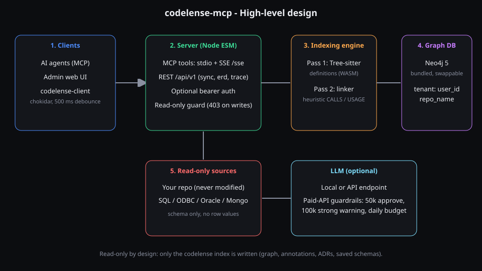
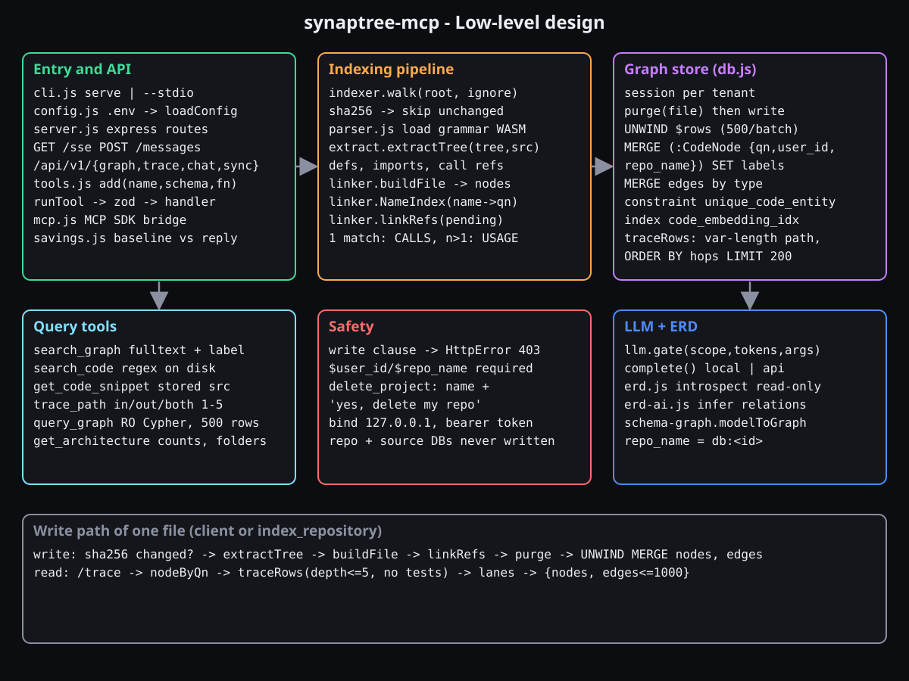

# codelense-mcp

A multi-tenant **code knowledge graph** for AI agents. It parses a repository with Tree-sitter,
links symbols across files, stores the result in Neo4j, and exposes it through an
[MCP](https://modelcontextprotocol.io) server (stdio and SSE). It also ships an admin web UI with a
animated call-flow trace, architecture view, and database ERDs that are saved into the same graph so
agents can see your schema next to your code.

**Read-only by design.** The MCP never changes your repository or your source databases. The only thing
it writes is its own index (graph, annotations, ADRs, saved database schemas).

## What problem does it solve?

AI coding agents work blind on large codebases. To answer "what breaks if I change `verifyJwt`?"
they usually grep, open file after file, and stuff raw source into the context window. That is
slow, burns tokens, misses relationships that span files, and gets worse as the repo grows.

codelense-mcp indexes the repository once into a graph of symbols (functions, classes, routes,
types, files) and the relationships between them (calls, imports, inheritance, type usage). The
agent then asks precise structural questions instead of reading code. The same graph can hold your
database schema (SQL and NoSQL), so the agent also knows which tables a piece of code touches.

## How it helps

- **Fewer tokens, faster answers:** a query returns a small, relevant slice (a call path, a list
  of callers, one snippet) instead of whole files.
- **Impact analysis:** `trace_path` and `detect_changes` show what calls a symbol and what a
  change may affect before you make it.
- **Navigation and onboarding:** `get_architecture`, `search_graph` and `search_code` give a map
  of an unfamiliar repo in a few calls.
- **Schema-aware agents:** `erd_save_to_index`, `get_db_schema` and `get_table_relationships` let an
  LLM understand tables, collections and how they relate.
- **Stays current:** `codelense-client` (chokidar, 500 ms debounce) re-indexes only the files you change.
- **Scales and isolates:** the graph lives in Neo4j and is partitioned per user and repository.
- **Token guardrails:** asking an LLM about a flow is estimated first; large asks need approval.
- **Works with any MCP client:** stdio for local agents, SSE for remote or shared setups.

## Architecture

| High-level design | Low-level design |
| --- | --- |
| [](docs/hld.svg) | [](docs/lld.svg) |

## The UI

Start the server and open <http://localhost:8787/ui/>. Light and dark themes are supported.

- **Trace:** a Flow-Like style call graph (React + xyflow). Edges animate only for the selected
  node, so the rest stays still. Depth 1-3, SVG (grouped layers) and CSV export, reset button.
- **Architecture:** counts, languages, layers, entrypoints, hotspots and ADRs.
- **ERD:** pick a saved connection and its stored schema loads from the index. **Sync up** reads the
  database (read-only), **Generate** uses a *local* LLM to infer relationships and group tables
  (grayed out with a tooltip until a local LLM is configured). Every result is saved to the index
  automatically. **Delete** removes only the saved schema in the codelense index and needs the
  authorization checkbox; your database and repos are never touched.
- **Sync:** index a folder, force re-sync, delete a project (two guardrails: type the repo name,
  then type `yes, delete my repo`; this clears the index only). Stale projects can be kept for
  3 or 6 more months.
- **Settings:** read-only database connections (PostgreSQL, MySQL, Oracle, ODBC, SQLite, MongoDB),
  LLM provider (Local or API) with token guardrails.
- **Query / Chat:** read-only Cypher and questions answered from the graph.

## Quick start

```bash
git clone https://github.com/maxh8086/codelense-mcp && cd codelense-mcp
npm install
node scripts/init-env.mjs     # writes .env with a random Neo4j password and ports (never printed)
docker compose up -d          # bundled Neo4j 5 Community, compose project "codelense"
npm start                     # API + UI + SSE on http://127.0.0.1:8787
```

Or run everything in Docker: the image binds `0.0.0.0`; outside Docker the default bind is
`127.0.0.1`. `.env` is authoritative for `NEO4J_*` and `CODELENSE_*` (it overrides the parent
environment), and the default Bolt URI is `bolt://127.0.0.1:17687`, not the usual 7687, so it never
collides with another Neo4j on your machine. Use `NEO4J_URI` to point at Neo4j Enterprise, Aura or Memgraph.

### Use it from an MCP client

```bash
claude mcp add codelense -- node /path/to/codelense-mcp/src/cli.js --stdio
codex mcp add codelense -- node /path/to/codelense-mcp/src/cli.js --stdio
```

SSE clients connect to `http://127.0.0.1:8787/sse`. Set `CODELENSE_TOKEN` to require a bearer token.
Every tool takes a `project` argument. If you route through TokenFrugal, index your checkout in
codelense under the same project name (the checkout folder slug) that its gateway injects.

### Keep it in sync

Run `codelense-client` next to your code. It watches the folder and posts changed files to
`/api/v1/sync`; each file is purged and rebuilt atomically. Service files for systemd, NSSM
(Windows) and launchd are in `client/`.

## Tools

Indexing and graph: `index_repository`, `list_projects`, `index_status`, `snooze_project`,
`delete_project`, `search_graph`, `search_code`, `get_code_snippet`, `trace_path`, `query_graph`
(read-only, writes return 403), `get_architecture`, `get_graph_schema`, `detect_changes`,
`manage_adr`, `ingest_traces`, `annotate_element`, `get_annotations`.

LLM (with guardrails): `estimate_cost`, `ask_flow`, `summarize_symbol`, `get_llm_settings`,
`set_llm_settings`, `get_usage`. Asks under 50k tokens run, 50k-100k need approval, above 100k need a
strong confirmation. There is also a per-minute call cap, a daily budget and a timeout.

Databases (read-only): `erd_list_connections`, `erd_save_connection`, `erd_delete_connection`,
`erd_test_connection`, `erd_get_model`, `erd_export`, `erd_ai_generate`, `erd_save_to_index`,
`list_db_schemas`, `delete_db_schema`, `get_db_schema`, `get_table_relationships`. NoSQL schemas
are sampled and depth/field-limited, and are reported as truncated when limits apply. Only names,
types and flags are stored, never row values.

## Accuracy: linking is heuristic

Cross-file linking is **not** a full language server. It resolves names against a global symbol
table built from the syntax trees. Calls that match exactly one target become `CALLS`; ambiguous
ones are recorded as `USAGE`. Dynamic dispatch, reflection, macros and generated code can be
missed or mislinked. Treat the graph as a fast, useful map rather than ground truth. Relationships
inferred by name or by a local LLM in an ERD are marked `inferred_name` / `inferred_llm`, not declared.

Languages without a bundled Tree-sitter grammar (for example R, SQL, GraphQL, Protocol Buffers)
get lightweight pattern-based extraction instead of a full parse. Grammars run as WASM
(`web-tree-sitter`), so there are no native bindings and nothing to compile.

## Tests

```bash
npm test      # node --test tests/unit/*.test.js
```

## License

Apache License 2.0. See [LICENSE](LICENSE).
